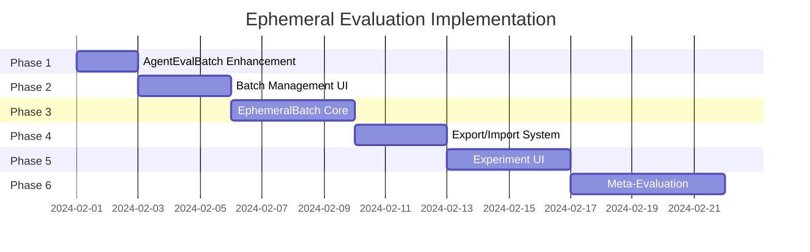

# Ephemeral Evaluation Implementation Strategy

## Executive Summary

This document outlines a phased approach to implementing ephemeral evaluations in RoastMyPost. The strategy focuses on incremental improvements, with each phase delivering immediate value while building toward a comprehensive experimentation system.

The core concept: Enable rapid testing of agent configurations on specific documents without polluting the production database, while reusing existing infrastructure and maintaining backwards compatibility.

## Phase 1: Enhanced AgentEvalBatch (1-2 days)

### Goal
Extend `AgentEvalBatch` to support specific document selection instead of only random selection via `targetCount`.

### Implementation

#### 1.1 API Changes

```typescript
// POST /api/agents/[agentId]/eval-batch
interface CreateBatchRequest {
  name?: string;
  
  // NEW: Specific document selection
  documentIds?: string[];
  
  // EXISTING: Random selection (deprecated in favor of documentIds)
  targetCount?: number;
  
  // NEW: Options for document selection
  options?: {
    repeatCount?: number;  // Run each document N times (default: 1)
    shuffle?: boolean;     // Randomize order (default: false)
  };
}

// Response
interface CreateBatchResponse {
  batch: {
    id: string;
    name: string;
    agentId: string;
    createdAt: string;
    targetCount: number;        // Total evaluations created
    documentIds: string[];       // Documents included
    jobCount: number;           // Jobs created
  };
  jobs: Array<{
    id: string;
    documentId: string;
    status: 'PENDING';
  }>;
}
```

#### 1.2 Validation Logic

```typescript
async function validateBatchRequest(body: CreateBatchRequest) {
  // Mutual exclusivity
  if (body.documentIds && body.targetCount) {
    throw new Error("Cannot specify both documentIds and targetCount");
  }
  
  if (!body.documentIds && !body.targetCount) {
    throw new Error("Must specify either documentIds or targetCount");
  }
  
  // Document validation
  if (body.documentIds) {
    const docs = await prisma.document.findMany({
      where: { id: { in: body.documentIds } },
      select: { id: true }
    });
    
    const foundIds = new Set(docs.map(d => d.id));
    const missing = body.documentIds.filter(id => !foundIds.has(id));
    
    if (missing.length > 0) {
      throw new Error(`Documents not found: ${missing.join(', ')}`);
    }
  }
  
  // Options validation
  if (body.options?.repeatCount && body.options.repeatCount > 10) {
    throw new Error("repeatCount cannot exceed 10");
  }
}
```

#### 1.3 Database Migration

```sql
-- Add column to track requested documents
ALTER TABLE "AgentEvalBatch" 
ADD COLUMN "requestedDocumentIds" TEXT[] DEFAULT '{}';

-- Add index for better query performance
CREATE INDEX "AgentEvalBatch_requestedDocumentIds_idx" 
ON "AgentEvalBatch" USING GIN("requestedDocumentIds");
```

#### 1.4 Usage Examples

```bash
# Test agent on specific documents
curl -X POST /api/agents/advisor-v1/eval-batch \
  -H "Content-Type: application/json" \
  -d '{
    "name": "Testing advisor on edge cases",
    "documentIds": ["doc-1", "doc-2", "doc-3"],
    "options": {
      "repeatCount": 3,
      "shuffle": true
    }
  }'

# Backwards compatible: random selection
curl -X POST /api/agents/advisor-v1/eval-batch \
  -H "Content-Type: application/json" \
  -d '{
    "name": "Random sample test",
    "targetCount": 20
  }'
```

### Benefits
- Precise control over test documents
- Reproducible test sets
- Backwards compatible
- Foundation for ephemeral experiments

## Phase 2: Batch Management UI (2-3 days)

### Goal
Improve the UI for viewing and managing `AgentEvalBatch` results, making it easier to compare evaluations.

### Implementation

#### 2.1 Batch List View

```tsx
// /agents/[agentId]/batches
interface BatchListItem {
  id: string;
  name: string;
  createdAt: string;
  documentCount: number;
  jobStats: {
    total: number;
    completed: number;
    failed: number;
    pending: number;
  };
  averageGrade?: number;
  isEphemeral: boolean;
}

function BatchListPage() {
  return (
    <div>
      <h1>Evaluation Batches</h1>
      
      {/* Filter controls */}
      <div className="flex gap-4 mb-4">
        <Select value={filter} onChange={setFilter}>
          <option value="all">All Batches</option>
          <option value="production">Production Only</option>
          <option value="ephemeral">Experiments Only</option>
        </Select>
        
        <Input 
          placeholder="Search by name..." 
          value={search}
          onChange={setSearch}
        />
      </div>
      
      {/* Batch list */}
      <div className="space-y-4">
        {batches.map(batch => (
          <BatchCard 
            key={batch.id}
            batch={batch}
            onView={() => router.push(`/batches/${batch.id}`)}
            onCompare={() => addToComparison(batch.id)}
          />
        ))}
      </div>
    </div>
  );
}
```

#### 2.2 Batch Detail View

```tsx
// /batches/[batchId]
function BatchDetailPage() {
  return (
    <div>
      {/* Batch summary */}
      <BatchSummary batch={batch} />
      
      {/* Document-level results */}
      <Tabs>
        <TabsList>
          <TabsTrigger value="by-document">By Document</TabsTrigger>
          <TabsTrigger value="by-status">By Status</TabsTrigger>
          <TabsTrigger value="timeline">Timeline</TabsTrigger>
        </TabsList>
        
        <TabsContent value="by-document">
          <DocumentResultsTable 
            evaluations={batch.evaluations}
            groupBy="document"
          />
        </TabsContent>
      </Tabs>
      
      {/* Export options */}
      <ExportSection batchId={batch.id} />
    </div>
  );
}
```

#### 2.3 Comparison View

```tsx
// /batches/compare?ids=batch1,batch2
function BatchComparisonPage() {
  return (
    <div className="grid grid-cols-2 gap-4">
      {batches.map(batch => (
        <div key={batch.id}>
          <h2>{batch.name}</h2>
          <BatchMetrics batch={batch} />
          <DocumentScores 
            evaluations={batch.evaluations}
            highlightDifferences={true}
          />
        </div>
      ))}
    </div>
  );
}
```

### Benefits
- Better visibility into batch results
- Easy comparison between runs
- Foundation for experiment analysis

## Phase 3: EphemeralBatch Implementation (3-4 days)

### Goal
Implement the `EphemeralBatch` system for temporary experiments with automatic cleanup.

### Implementation

#### 3.1 API Design

```typescript
// POST /api/experiments/create
interface CreateExperimentRequest {
  trackingId?: string;  // User-friendly ID (auto-generated if not provided)
  name: string;
  description?: string;
  
  agent: {
    // Option 1: Inline configuration
    config?: {
      name: string;
      primaryInstructions: string;
      selfCritiqueInstructions?: string;
      providesGrades?: boolean;
    };
    
    // Option 2: Base on existing agent
    baseAgentId?: string;
    modifications?: Partial<AgentConfig>;
  };
  
  documents: {
    // Option 1: Existing document IDs
    documentIds?: string[];
    
    // Option 2: Import new documents
    urls?: string[];
    
    // Option 3: Inline content
    inline?: Array<{
      title: string;
      content: string;
      author?: string;
    }>;
  };
  
  options?: {
    repeatCount?: number;
    expiresInDays?: number;  // Default: 7
  };
}

// Response
interface CreateExperimentResponse {
  experiment: {
    id: string;
    trackingId: string;
    trackingUrl: string;  // /experiments/[trackingId]
    expiresAt: string;
  };
  batch: {
    id: string;
    jobCount: number;
  };
  agent: {
    id: string;
    name: string;
    isEphemeral: true;
  };
}
```

#### 3.2 Tracking & Discovery

```typescript
// GET /api/experiments
interface ListExperimentsParams {
  userId?: string;
  status?: 'active' | 'completed' | 'all';
  search?: string;
  limit?: number;
  offset?: number;
}

// GET /api/experiments/[trackingId]
interface ExperimentDetails {
  id: string;
  trackingId: string;
  name: string;
  description?: string;
  createdAt: string;
  expiresAt: string;
  
  agent: {
    id: string;
    name: string;
    config: AgentConfig;
  };
  
  batches: Array<{
    id: string;
    createdAt: string;
    jobStats: JobStats;
    results: EvaluationSummary[];
  }>;
  
  actions: {
    canPromote: boolean;
    canRerun: boolean;
    canExtend: boolean;
  };
}
```

#### 3.3 Cleanup System

```typescript
// Cron job: Clean up expired experiments
async function cleanupExpiredExperiments() {
  const expired = await prisma.ephemeralBatch.findMany({
    where: {
      expiresAt: { lt: new Date() }
    },
    include: {
      agent: true,
      agentEvalBatches: {
        include: {
          jobs: true
        }
      }
    }
  });
  
  for (const batch of expired) {
    // Check if any jobs are still running
    const runningJobs = batch.agentEvalBatches
      .flatMap(b => b.jobs)
      .filter(j => j.status === 'RUNNING');
    
    if (runningJobs.length > 0) {
      console.log(`Skipping cleanup of ${batch.id} - jobs still running`);
      continue;
    }
    
    // Delete cascade will handle related records
    await prisma.ephemeralBatch.delete({
      where: { id: batch.id }
    });
    
    console.log(`Cleaned up experiment ${batch.trackingId}`);
  }
}
```

### Benefits
- Clean experiment tracking
- Automatic cleanup
- No production data pollution

## Phase 4: Export & Import System (2-3 days)

### Goal
Enable easy export of experiment results and agent configurations for sharing and analysis.

### Implementation

#### 4.1 Export Formats

```typescript
// GET /api/experiments/[trackingId]/export
interface ExportOptions {
  format: 'json' | 'toml' | 'markdown';
  include: {
    config: boolean;
    results: boolean;
    documents: boolean;
    rawData: boolean;
  };
}

// JSON Export Structure
interface ExperimentExport {
  version: "1.0";
  exported: string;  // ISO timestamp
  
  experiment: {
    trackingId: string;
    name: string;
    description?: string;
    createdAt: string;
  };
  
  agent: {
    name: string;
    config: {
      primaryInstructions: string;
      selfCritiqueInstructions?: string;
      providesGrades: boolean;
    };
  };
  
  results: Array<{
    documentId: string;
    documentTitle: string;
    evaluations: Array<{
      createdAt: string;
      grade?: number;
      summary: string;
      highlights: number;
      processingTime: number;
      cost: number;
    }>;
  }>;
  
  aggregateMetrics: {
    averageGrade: number;
    totalCost: number;
    totalTime: number;
    successRate: number;
  };
}
```

#### 4.2 Agent Configuration Export

```toml
# GET /api/agents/[agentId]/export?format=toml
[agent]
name = "Document Advisor v3"
version = "3.0"
description = "Provides actionable advice for improving documents"

[agent.config]
provides_grades = true

[agent.instructions]
primary = """
You are a document advisor focused on...
"""

self_critique = """
Review your evaluation for...
"""

[agent.metadata]
created = "2024-01-15T10:30:00Z"
author = "user@example.com"
experiment_tracking_id = "advisor-v3-test"
```

#### 4.3 Import Capabilities

```typescript
// POST /api/experiments/import
interface ImportRequest {
  source: {
    type: 'json' | 'toml' | 'url';
    data?: string;  // For json/toml
    url?: string;   // For URL import
  };
  
  options: {
    runImmediately?: boolean;
    documentIds?: string[];  // Override documents
    namePrefix?: string;     // Prefix for imported items
  };
}
```

### Benefits
- Easy sharing of experiments
- Configuration portability
- Data analysis capabilities

## Phase 5: Experiment UI (3-4 days)

### Goal
Create dedicated UI for managing and analyzing experiments.

### Implementation

#### 5.1 Experiment Dashboard

```tsx
// /experiments
function ExperimentsDashboard() {
  return (
    <div>
      {/* Quick actions */}
      <div className="grid grid-cols-3 gap-4 mb-8">
        <QuickAction 
          title="New Experiment"
          description="Test a new agent configuration"
          href="/experiments/new"
          icon={<BeakerIcon />}
        />
        <QuickAction 
          title="Import Config"
          description="Import agent from TOML/JSON"
          onClick={openImportModal}
          icon={<UploadIcon />}
        />
        <QuickAction 
          title="Compare Results"
          description="Compare multiple experiments"
          href="/experiments/compare"
          icon={<ChartIcon />}
        />
      </div>
      
      {/* Active experiments */}
      <section>
        <h2>Active Experiments</h2>
        <ExperimentGrid 
          experiments={activeExperiments}
          view="cards"
        />
      </section>
      
      {/* Recent results */}
      <section>
        <h2>Recent Results</h2>
        <ExperimentTable 
          experiments={recentExperiments}
          columns={['name', 'created', 'status', 'avgGrade', 'actions']}
        />
      </section>
    </div>
  );
}
```

#### 5.2 New Experiment Wizard

```tsx
// /experiments/new
function NewExperimentWizard() {
  const [step, setStep] = useState(1);
  
  return (
    <WizardLayout>
      {step === 1 && (
        <StepOne>
          <h2>Configure Agent</h2>
          <Tabs>
            <TabsList>
              <TabsTrigger value="new">New Configuration</TabsTrigger>
              <TabsTrigger value="modify">Modify Existing</TabsTrigger>
              <TabsTrigger value="import">Import TOML</TabsTrigger>
            </TabsList>
            
            <TabsContent value="new">
              <AgentConfigEditor 
                onChange={setAgentConfig}
                templates={agentTemplates}
              />
            </TabsContent>
          </Tabs>
        </StepOne>
      )}
      
      {step === 2 && (
        <StepTwo>
          <h2>Select Test Documents</h2>
          <DocumentSelector
            mode="multiple"
            categories={['recent', 'bookmarked', 'standard-tests']}
            selected={selectedDocs}
            onChange={setSelectedDocs}
          />
          <div className="mt-4">
            <Label>Or paste URLs to import:</Label>
            <Textarea 
              placeholder="One URL per line..."
              onChange={handleUrlInput}
            />
          </div>
        </StepTwo>
      )}
      
      {step === 3 && (
        <StepThree>
          <h2>Review & Launch</h2>
          <ExperimentSummary 
            agent={agentConfig}
            documents={selectedDocs}
            estimatedCost={calculateCost()}
            estimatedTime={calculateTime()}
          />
          <Button onClick={launchExperiment}>
            Launch Experiment
          </Button>
        </StepThree>
      )}
    </WizardLayout>
  );
}
```

#### 5.3 Experiment Results View

```tsx
// /experiments/[trackingId]
function ExperimentResultsPage() {
  return (
    <div>
      {/* Header with key metrics */}
      <ExperimentHeader 
        experiment={experiment}
        onPromote={handlePromote}
        onRerun={handleRerun}
        onExport={handleExport}
      />
      
      {/* Results visualization */}
      <Tabs defaultValue="overview">
        <TabsList>
          <TabsTrigger value="overview">Overview</TabsTrigger>
          <TabsTrigger value="by-document">By Document</TabsTrigger>
          <TabsTrigger value="comparison">Compare Versions</TabsTrigger>
          <TabsTrigger value="raw-data">Raw Data</TabsTrigger>
        </TabsList>
        
        <TabsContent value="overview">
          <div className="grid grid-cols-2 gap-8">
            <GradeDistributionChart data={gradeData} />
            <ProcessingTimeChart data={timeData} />
            <TopIssuesFound issues={topIssues} />
            <CostBreakdown costs={costData} />
          </div>
        </TabsContent>
        
        <TabsContent value="by-document">
          <DocumentResultsList 
            results={documentResults}
            onViewEvaluation={openEvaluationModal}
          />
        </TabsContent>
      </Tabs>
    </div>
  );
}
```

### Benefits
- Intuitive experiment workflow
- Rich results visualization
- Easy comparison and analysis

## Phase 6: Meta-Evaluation System (4-5 days)

### Goal
Implement automated quality assessment of evaluations to enable rapid iteration.

### Implementation

#### 6.1 Meta-Evaluation API

```typescript
// POST /api/experiments/[trackingId]/meta-evaluate
interface MetaEvaluateRequest {
  evaluatorModel?: 'gpt-4' | 'claude-3-opus';
  
  criteria?: {
    specificity: { weight: number; enabled: boolean };
    actionability: { weight: number; enabled: boolean };
    coverage: { weight: number; enabled: boolean };
    consistency: { weight: number; enabled: boolean };
    tone: { weight: number; enabled: boolean };
  };
  
  compareWith?: {
    experimentIds?: string[];  // Compare with other experiments
    baselineAgentId?: string;  // Compare with production agent
  };
}

interface MetaEvaluationResult {
  scores: {
    overall: number;
    specificity: number;
    actionability: number;
    coverage: number;
    consistency: number;
    tone: number;
  };
  
  insights: {
    strengths: string[];
    weaknesses: string[];
    improvements: string[];
  };
  
  comparison?: {
    betterThan: string[];
    worseThan: string[];
    similar: string[];
  };
  
  suggestedPromptEdits?: Array<{
    section: 'primary' | 'selfCritique';
    original: string;
    suggested: string;
    rationale: string;
  }>;
}
```

#### 6.2 Automated Improvement Loop

```typescript
// POST /api/experiments/improve
interface ImprovementRequest {
  experimentId: string;
  strategy: 'iterative' | 'parallel-variants' | 'genetic';
  
  options: {
    maxIterations?: number;
    targetScore?: number;
    documentSample?: string[];  // Subset for faster iteration
    
    // For parallel variants
    variantCount?: number;
    variationDimensions?: ('tone' | 'detail' | 'structure')[];
  };
}

interface ImprovementResult {
  iterations: Array<{
    iteration: number;
    experimentId: string;
    scores: MetricScores;
    changes: string[];
  }>;
  
  winner: {
    experimentId: string;
    improvement: number;  // % improvement
    config: AgentConfig;
  };
}
```

### Benefits
- Automated quality assessment
- Data-driven improvements
- Rapid iteration capabilities

## Phase 7: Advanced Features (Future)

### 7.1 Scheduled Experiments
- Run experiments on a schedule
- Track performance over time
- Regression detection

### 7.2 Experiment Templates
- Save successful configurations as templates
- Share templates across teams
- Template marketplace

### 7.3 Advanced Analytics
- Statistical significance testing
- Cohort analysis by document type
- Performance prediction models

## Implementation Timeline



## Success Metrics

1. **Phase 1**: Ability to run targeted evaluations
2. **Phase 2**: 50% reduction in time to analyze batch results  
3. **Phase 3**: Zero production data pollution from experiments
4. **Phase 4**: Experiments shareable via single URL/file
5. **Phase 5**: Time to create new experiment < 2 minutes
6. **Phase 6**: 80% of experiments show measurable improvement

## Risk Mitigation

1. **Database Growth**: Implement aggressive cleanup policies
2. **Cost Overruns**: Add spending limits per user/experiment
3. **Complexity**: Each phase is independently valuable
4. **Migration**: All changes are backwards compatible

This phased approach ensures continuous value delivery while building toward a comprehensive experimentation platform.